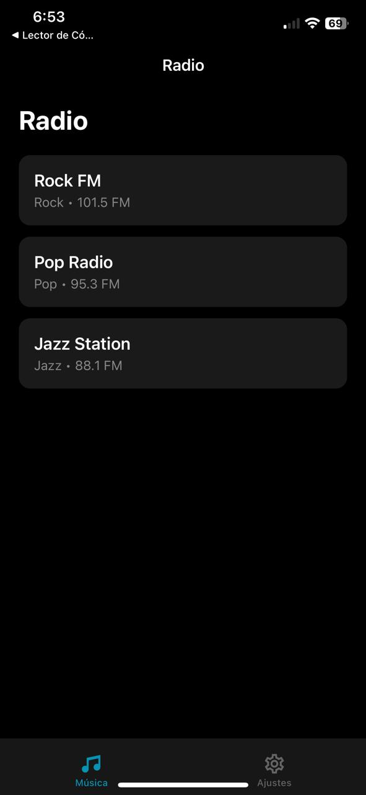
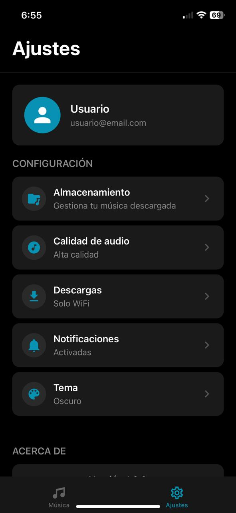

# Music Player - App de Reproductor de Música

## 1. Identificación del Proyecto

- **Nombre de la App:** Music Player
- **Asignatura/Profesor:** Desarrollo de Aplicaciones Móviles / M.C. Leonel González Vidales
- **Periodo/Fecha:** Octubre 2025
- **URL del Repositorio:** https://github.com/tu-usuario/music-player-app

## 2. Descripción del Proyecto

Music Player es una aplicación móvil desarrollada con React Native y Expo que permite a los usuarios reproducir música desde archivos descargados en su dispositivo. La aplicación cuenta con una interfaz moderna con tema oscuro, navegación fluida y controles completos de reproducción.

### Características Principales:
- 📻 **Radio**: Estaciones de radio predefinidas con diferentes géneros musicales
- ❤️ **Favoritos**: Gestión de canciones favoritas con opciones de agregar/eliminar
- 🔍 **Búsqueda**: Sistema de búsqueda de canciones y artistas
- 🎵 **Reproductor Completo**: Controles avanzados de reproducción (Play, Pause, Skip, Shuffle, Repeat)
- ⚙️ **Ajustes**: Configuración de almacenamiento, calidad de audio y preferencias
- 🎨 **Interfaz Moderna**: Diseño con tema oscuro y componentes estilizados
- 🧭 **Navegación Intuitiva**: Sistema de navegación por tabs con transiciones suaves

### Funcionalidades Implementadas:
- Lista de estaciones de radio
- Gestión de canciones favoritas
- Búsqueda de música en tiempo real
- Reproductor con controles completos:
  - Reproducir/Pausar
  - Canción anterior/siguiente
  - Modo aleatorio (Shuffle)
  - Repetición (Off/One/All)
  - Agregar a favoritos
  - Eliminar canción
- Gestión de almacenamiento
- Configuración de calidad de audio
- Control de descargas
- Diseño responsivo y optimizado para móviles
- Estructura de código modular y escalable

## 3. Tecnologías y Versiones Utilizadas

### Stack Tecnológico:
- **React Native:** 0.81.4
- **React:** 19.1.0
- **Expo:** ~54.0.3
- **React Navigation:** v7.1.17
  - Native Stack: v7.3.26
  - Bottom Tabs: v7.0.8
- **React Native Screens:** ~4.16.0
- **React Native Safe Area Context:** ~5.6.0
- **Expo Vector Icons:** ~14.0.0
- **React Native Community Slider:** ^4.5.2
- **Expo AV:** ~14.0.7
- **Expo File System:** ~17.0.1

### Herramientas de Desarrollo Requeridas:

- **Node.js:** v18.17.0 o superior
  ```bash
  node --version
  ```
- **NPM:** 9.0.0+ o Yarn v1.22.19+
  ```bash
  npm --version
  # o
  yarn --version
  ```
- **Expo CLI:** v6.3.0+
  ```bash
  npx expo --version
  ```
- **Android Studio:** v2022.3+ con Android SDK 33+ **o** Expo Go app en dispositivo físico
  ```bash
  # Verificar Android SDK
  adb --version
  ```

### Verificación de Entorno:
```bash
npx expo doctor
```

## 4. Estructura del Proyecto

### Organización de Archivos:
```
music-player-app/
├── App.js                          # Componente principal de la aplicación
├── app.json                        # Configuración de Expo
├── package.json                    # Dependencias y scripts
├── index.js                        # Punto de entrada
├── global.css                      # Estilos globales
├── assets/                         # Recursos estáticos
│   ├── adaptive-icon.png
│   ├── favicon.png
│   ├── icon.png
│   └── splash-icon.png
├── components/
│   └── ui/
│       └── gluestack-ui-provider/
│           └── index.tsx
└── src/
    ├── components/                 # Componentes reutilizables
    │   └── Navigation/
    │       ├── IconBack.js
    │       └── index.js
    ├── navigations/                # Configuración de navegación
    │   ├── stacks/
    │   │   ├── MusicNavigation.js
    │   │   ├── SettingsNavigation.js
    │   │   └── index.js
    │   ├── BottomTabNavigation/
    │   │   ├── BottomTabNavigation.js
    │   │   ├── BottomTabNavigation.styles.js
    │   │   └── index.js
    │   ├── AppNavigation.js
    │   ├── HandlerNavigation.js
    │   ├── Styles.styles.js
    │   └── index.js
    ├── screens/                    # Pantallas de la aplicación
    │   ├── Music/
    │   │   ├── RadioScreen.js
    │   │   ├── FavoritesScreen.js
    │   │   ├── SearchScreen.js
    │   │   ├── PlayerScreen.js
    │   │   └── index.js
    │   └── Settings/
    │       ├── SettingsScreen.js
    │       ├── StorageScreen.js
    │       └── index.js
    ├── utils/                      # Utilidades y constantes
    │   ├── screens.js
    │   └── index.js
    └── screenshots/                # Capturas de pantalla
        ├── pantalla1.jpg
        └── pantalla2.jpg
```

### Arquitectura de la Aplicación:
- **App.js**: Componente raíz con NavigationContainer
- **HandlerNavigation.js**: Manejador de navegación principal
- **AppNavigation.js**: Configuración del Stack Navigator y modales
- **BottomTabNavigation.js**: Navegación por tabs (Música y Ajustes)
- **MusicNavigation.js**: Stack de pantallas de música
- **SettingsNavigation.js**: Stack de pantallas de ajustes
- **screens.js**: Constantes para nombres de pantallas

## 5. Instalación y Configuración

### Instalación de Dependencias:
```bash
# Clonar el repositorio
git clone https://github.com/tu-usuario/music-player-app
cd music-player-app

# Instalar dependencias con npm
npm install

# O con yarn
yarn install
```

### Dependencias del Proyecto:

| Dependencia | Versión | Propósito |
|-------------|---------|-----------|
| `@react-navigation/native` | ^7.1.17 | Core de navegación entre pantallas, manejo de estado |
| `@react-navigation/native-stack` | ^7.3.26 | Stack navigator para navegación jerárquica |
| `@react-navigation/bottom-tabs` | ^7.0.8 | Navegación por tabs inferiores |
| `react-native-screens` | ~4.16.0 | Optimización de rendimiento para transiciones nativas |
| `react-native-safe-area-context` | ~5.6.0 | Manejo de áreas seguras (notch, barras de estado) |
| `@expo/vector-icons` | ~14.0.0 | Iconos para la interfaz (MaterialCommunityIcons) |
| `@react-native-community/slider` | ^4.5.2 | Control deslizante para barra de progreso |
| `expo-av` | ~14.0.7 | Reproducción de audio y video |
| `expo-file-system` | ~17.0.1 | Acceso al sistema de archivos del dispositivo |
| `expo-status-bar` | ~3.0.8 | Control de apariencia de barra de estado |
| `native-base` | ^3.4.28 | Componentes UI adicionales |
| `expo` | ~54.0.3 | Framework de desarrollo móvil |
| `react` | 19.1.0 | Biblioteca de interfaz de usuario |
| `react-native` | 0.81.4 | Framework de desarrollo móvil multiplataforma |

### Comandos de Instalación:
```bash
# 1. Navegación
yarn add @react-navigation/native @react-navigation/native-stack @react-navigation/bottom-tabs

# 2. Dependencias de navegación
yarn add react-native-screens react-native-safe-area-context

# 3. UI y componentes
yarn add @expo/vector-icons @react-native-community/slider native-base

# 4. Audio y archivos
yarn add expo-av expo-file-system
```

### Verificar instalación:
```bash
npm list --depth=0
# o
yarn list --depth=0
```

## 6. Ejecución de la Aplicación

### Scripts Disponibles:
```bash
# Iniciar servidor de desarrollo
npm start
# o
yarn start

# Ejecutar en Android (emulador/dispositivo)
npm run android
# o
npx expo start --android

# Ejecutar en iOS (solo macOS)
npm run ios
# o  
npx expo start --ios

# Ejecutar en web
npm run web
# o
npx expo start --web

# Modo túnel (para redes restrictivas)
npm start -- --tunnel
# o
yarn start --tunnel
```

### Primera Ejecución:
1. **Instalar dependencias:**
   ```bash
   npm install
   # o
   yarn install
   ```

2. **Iniciar el servidor de desarrollo:**
   ```bash
   npm start
   # o
   yarn start
   ```

3. **Conectar dispositivo:**
   - **Android:** Usar Expo Go o emulador
   - **iOS:** Usar Expo Go o simulador
   - **Web:** Se abrirá automáticamente en el navegador

### Notas de Entorno:
- **Emulador Android:** Debe estar iniciado antes de ejecutar `npm run android`
- **Dispositivo físico:** Usar Expo Go y escanear QR code
- **Túnel para redes restrictivas:** `npx expo start --tunnel`
- **Permisos:** La app requiere permisos de acceso a archivos para leer música

## 7. Funcionalidades de la Aplicación

### Pantalla de Radio (RadioScreen):
- **Estaciones Predefinidas**: Lista de estaciones de radio con diferentes géneros
- **Información de Estación**: Nombre, género y frecuencia FM
- **Reproducción**: Toca cualquier estación para comenzar a escuchar
- **Iconos Visuales**: Cada estación tiene un icono distintivo
- **Diseño**: Tarjetas con fondo oscuro y detalles en cyan



**Estaciones incluidas:**
- Rock FM (101.5 FM) - Género: Rock
- Pop Radio (95.3 FM) - Género: Pop
- Jazz Station (88.1 FM) - Género: Jazz
- Clásica (89.7 FM) - Género: Clásica
- Electrónica (103.2 FM) - Género: Electronic

### Pantalla de Favoritos (FavoritesScreen):
- **Lista de Favoritos**: Canciones marcadas como favoritas
- **Gestión**: Agregar/eliminar canciones de favoritos
- **Información**: Título, artista y duración
- **Estado Vacío**: Mensaje amigable cuando no hay favoritos
- **Carátula**: Miniatura visual para cada canción

### Pantalla de Búsqueda (SearchScreen):
- **Búsqueda en Tiempo Real**: Filtra canciones mientras escribes
- **Búsqueda Múltiple**: Por título de canción o nombre de artista
- **Resultados Dinámicos**: Actualización instantánea de resultados
- **Estado Vacío**: Mensaje cuando no hay resultados
- **Limpiar Búsqueda**: Botón para resetear la búsqueda

### Pantalla de Reproductor (PlayerScreen):
- **Carátula Grande**: Vista principal del álbum
- **Información de Canción**: Título y artista
- **Barra de Progreso**: Slider para navegar en la canción
- **Tiempos**: Tiempo actual y duración total
- **Controles Principales**:
  - ⏮️ Canción anterior
  - ▶️/⏸️ Play/Pause
  - ⏭️ Siguiente canción
- **Controles Secundarios**:
  - 🔀 Shuffle (Modo aleatorio)
  - 🔁 Repeat (Off/One/All)
- **Acciones Adicionales**:
  - ❤️ Agregar/quitar de favoritos
  - 🗑️ Eliminar canción
  - 📋 Ver lista de reproducción

### Pantalla de Ajustes (SettingsScreen):
- **Perfil de Usuario**: Avatar y email
- **Opciones de Configuración**:
  - 📁 Almacenamiento - Gestión de música descargada
  - 🎵 Calidad de audio - Alta calidad
  - ⬇️ Descargas - Solo WiFi
  - 🔔 Notificaciones - Activadas
  - 🎨 Tema - Oscuro
- **Información de App**: Versión 1.0.0



### Pantalla de Almacenamiento (StorageScreen):
- **Uso de Almacenamiento**: Barra visual del espacio usado
- **Estadísticas**: Espacio usado vs disponible
- **Música Descargada**: Cantidad de espacio ocupado por música
- **Lista de Archivos**: Archivos descargados con detalles (tamaño, fecha)
- **Gestión**: Opción para eliminar archivos individuales
- **Limpiar Caché**: Botón para liberar espacio

### Navegación por Tabs:
- **Tab Música** 🎵: Acceso a Radio, Favoritos y Búsqueda
- **Tab Ajustes** ⚙️: Configuración y almacenamiento
- **Indicadores Visuales**: Color cyan para tab activo, gris para inactivos
- **Iconos**: MaterialCommunityIcons para mejor visualización

### Características Técnicas:
- **Navegación Stack**: Transiciones suaves entre pantallas
- **Navegación Modal**: PlayerScreen y StorageScreen como modales
- **Diseño Responsivo**: Optimizado para diferentes tamaños de pantalla
- **Tema Oscuro**: Interfaz moderna con colores oscuros (#000, #1a1a1a)
- **Componentes Modulares**: Código organizado y reutilizable
- **Botón de Retroceso**: IconBack personalizado en todas las pantallas

## 8. Desarrollo y Extensión

### Próximas Funcionalidades Sugeridas:
- **Integración con Sistema de Archivos**: 
  - Escanear carpeta Downloads del dispositivo
  - Detectar archivos MP3, M4A, WAV, AAC
  - Extraer metadatos de archivos (título, artista, álbum)
- **Reproducción Real de Audio**:
  - Implementar AudioService completo
  - Reproducción en background
  - Controles en lock screen
  - Notificaciones de reproducción
- **Persistencia de Datos**:
  - AsyncStorage para favoritos
  - Historial de reproducción
  - Playlists personalizadas
- **Sistema de Ecualizador**: Ajustes de audio personalizados
- **Letras de Canciones**: Sincronización con lyrics APIs
- **Compartir Música**: Enviar canciones a otros dispositivos
- **Estadísticas**: Canciones más escuchadas, tiempo de reproducción

### Estructura para Nuevas Pantallas:
```javascript
// Ejemplo de nueva pantalla
import React from 'react';
import { View, Text, StyleSheet } from 'react-native';

export function NewScreen({ navigation }) {
  return (
    <View style={styles.container}>
      <Text style={styles.title}>Nueva Pantalla</Text>
    </View>
  );
}

const styles = StyleSheet.create({
  container: {
    flex: 1,
    backgroundColor: '#000',
    padding: 20,
  },
  title: {
    fontSize: 28,
    fontWeight: 'bold',
    color: '#fff',
  },
});
```

### Agregar Nuevas Rutas:
1. Actualizar `src/utils/screens.js` con nuevas constantes:
```javascript
const music = {
  // ... existentes
  newScreen: "NewScreen",
};
```

2. Agregar Screen en `src/navigations/stacks/MusicNavigation.js`:
```javascript
<Stack.Screen
  name={screens.tab.music.newScreen}
  component={NewScreen}
  options={{ title: "Nueva Pantalla" }}
/>
```

3. Crear componente en `src/screens/Music/NewScreen.js`

### Implementar AudioService:
```javascript
// src/services/AudioService.js
import { Audio } from 'expo-av';
import * as FileSystem from 'expo-file-system';

class AudioService {
  async scanDownloads() {
    // Escanear archivos de música
  }
  
  async loadAndPlay(track) {
    // Cargar y reproducir
  }
  
  async play() {
    // Reproducir
  }
  
  async pause() {
    // Pausar
  }
}

export default new AudioService();
```

## 9. Troubleshooting

### Problemas Comunes:
| Problema | Solución |
|----------|----------|
| **Error de instalación** | `npm install --legacy-peer-deps` o `yarn install --ignore-engines` |
| **Metro cache corrupto** | `npx expo start --clear` |
| **Puerto ocupado** | `npx expo start --port 8082` |
| **Dependencias desactualizadas** | `npx expo doctor` |
| **Error con Slider** | Verificar instalación de `@react-native-community/slider` |
| **Iconos no aparecen** | Reiniciar el bundler después de instalar `@expo/vector-icons` |
| **Error de navegación** | Verificar que todas las pantallas estén correctamente importadas |

### Comandos Útiles:
```bash
# Verificar entorno
npx expo doctor

# Limpiar cache
npx expo start --clear

# Reinstalar dependencias
rm -rf node_modules package-lock.json && npm install
# o
rm -rf node_modules yarn.lock && yarn install

# Verificar versiones
npm list @react-navigation/native
npm list expo

# Actualizar Expo
npx expo upgrade
```

### Errores Específicos de Audio:
```bash
# Si hay problemas con expo-av
expo install expo-av

# Si hay problemas con file-system
expo install expo-file-system

# Limpiar y reinstalar
expo install --fix
```

## 10. Recursos y Documentación

### Documentación Oficial:
- [Documentación de Expo](https://docs.expo.dev/)
- [React Navigation](https://reactnavigation.org/)
- [React Native Docs](https://reactnative.dev/)
- [Expo AV](https://docs.expo.dev/versions/latest/sdk/av/)
- [Expo File System](https://docs.expo.dev/versions/latest/sdk/filesystem/)
- [Material Community Icons](https://pictogrammers.com/library/mdi/)

### Tutoriales Relacionados:
- [Audio Playback with Expo](https://docs.expo.dev/guides/audio/)
- [File System Access](https://docs.expo.dev/guides/filesystem/)
- [Bottom Tab Navigation](https://reactnavigation.org/docs/bottom-tab-navigator)
- [Stack Navigator](https://reactnavigation.org/docs/stack-navigator)

### Herramientas Útiles:
- [Expo Snack](https://snack.expo.dev/) - Playground online
- [React Native Directory](https://reactnative.directory/) - Librería de componentes
- [Expo Icons](https://icons.expo.fyi/) - Explorador de iconos

---

**Desarrollado por:** Melvin Jaffet Peralta Flores  
**Basado en el template de:** M.C. Leonel González Vidales  
**Última actualización:** Octubre 2025  
**Versión:** 1.0.0